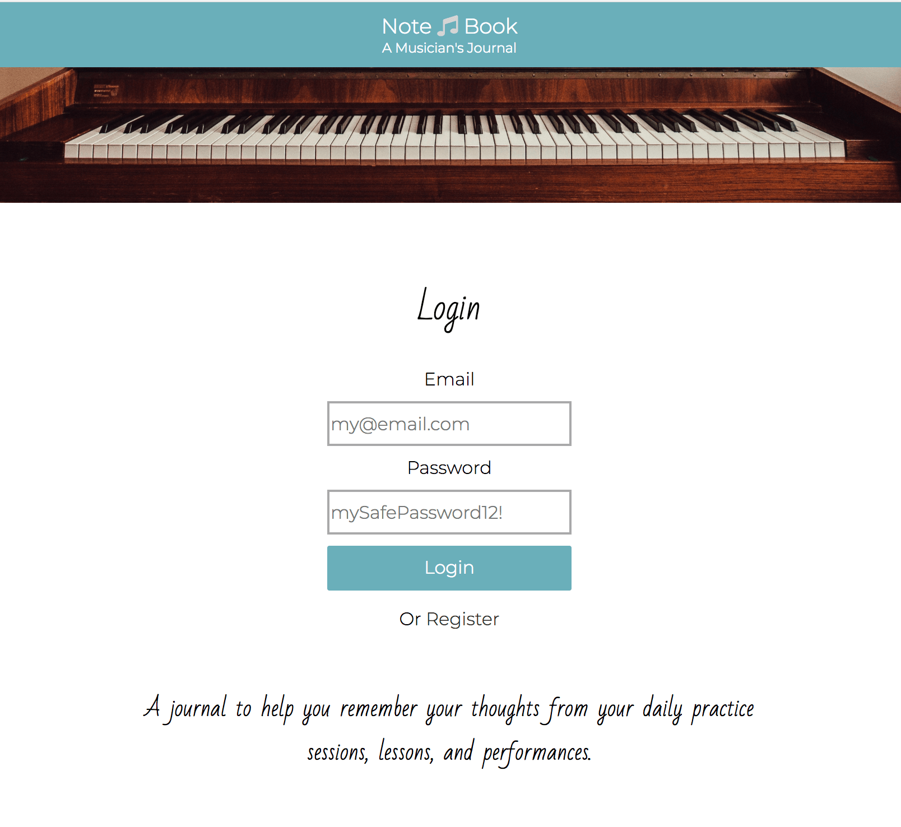
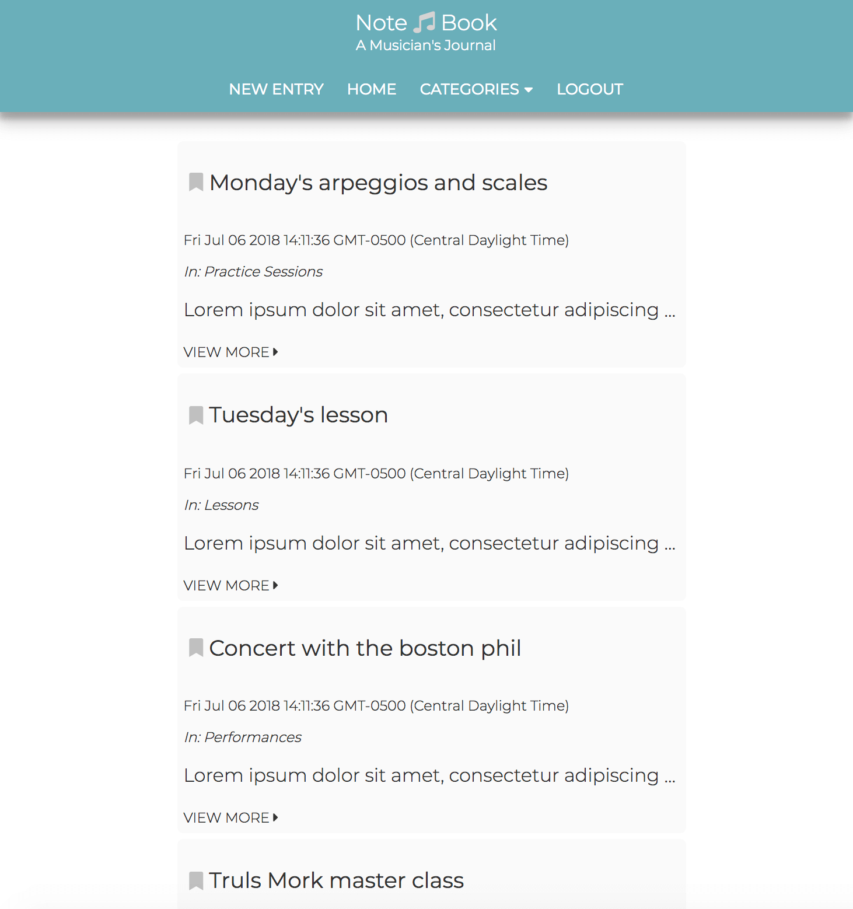
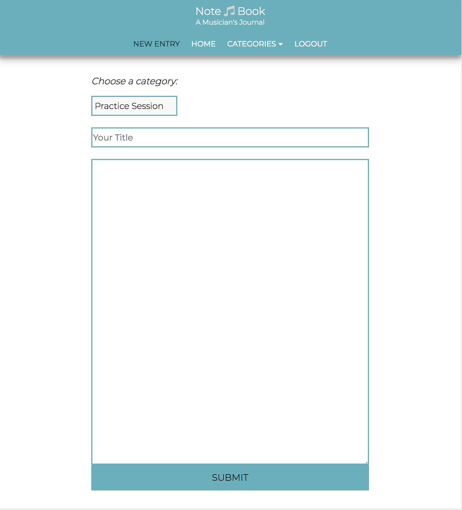
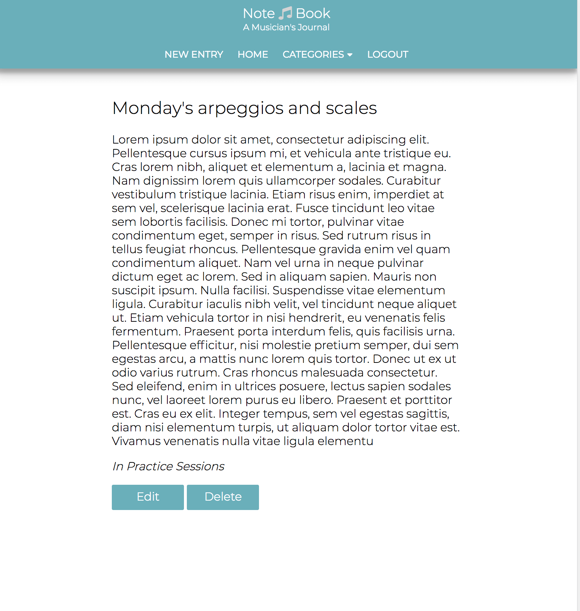
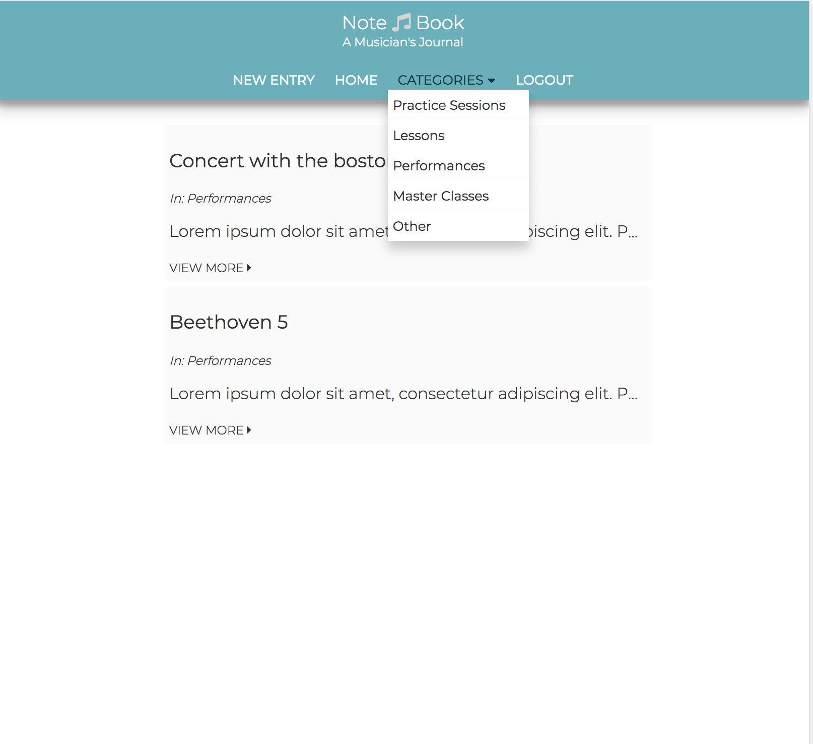

# Note Book #

A journaling web app to help you remember thoughts from your daily practice sessions, lessons, and performances.

## Screenshots ##

Login/register view

Posts view

New entry view  

Entry view  

Category view

## Demo ##

[Live Demo](https://calm-escarpment-51268.herokuapp.com/)

### Demo user details: ######
email: some@email.com 
password: some_password

## Summary ##

Note Book is a blogging web application targeted towards musicians. It is a personal journal made for a student musician to chronicle their practice sessions, lessons, master classes, performances, and other notes. The journal's aim is to assist the musician to remember useful experiences so that they can refer to them later. 

## Built Using ##

* html
* css
* JavaScript
* jQUery
* Node
* Express
* MongoDB

Testing
* Mocha
* Chai
* Chai-http

## Features ##

* Login/register your account
* Add posts to your own personal blog
* Each post is organized into a category
* Edit and delete posts

